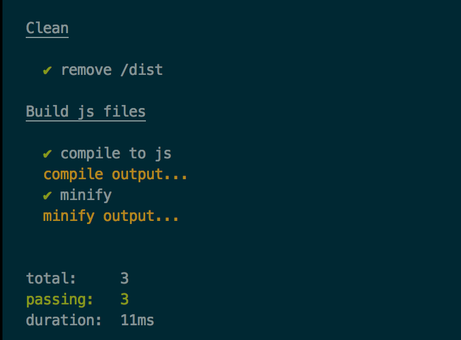

# make2tap

[](https://travis-ci.org/ArnaudRinquin/make2tap) [](https://codeclimate.com/github/ArnaudRinquin/make2tap) [](https://codeclimate.com/github/ArnaudRinquin/make2tap/coverage)


Leverage [`TAP`](https://testanything.org/) to transform your ugly `make` outputs into nice readable ones using any [TAP reporter](https://www.npmjs.com/search?q=TAP++reporter) like `tap-spec` or `tap-dot`.

## Usage

Assuming `make2tap` is in your path (using `npm scripts`), simply pipe `make` output to it

Assuming this is your `makefile`

```
clean:
	## Clean
	# remove /dist
	@rm -rf dist

build:
	## Build js files
	# compile to js
	@echo 'compile output...'
	# minify
	@echo 'minify output...'

```

Then

```bash
make clean compile | make2tap
```

Ouputs:

```
TAP version 13
# Clean
ok 1 - remove /dist
TAP version 13
# Build js files
ok 2 - compile to js
compile output...
ok 3 - minify
minify output...
1..3
```

Of course, you should pipe it to the [TAP reporter](https://www.npmjs.com/search?q=TAP++reporter) of your choice:

```bash
make clean build | make2tap | tap-spec
```



## Comment syntax

`make2tap` understand a few kinds of lines:

* `## Task title`: as a TAP Diagnostic, aka a _section_, or _title_
* `# Step name`: as a TAP test line, which will use a _single step_
* `anything else`: as regular output, not handled as part of the result but still shown, will us it to show commands output.

You'll probably want to structure your makefile as such:

```
build:
	## Build js files

	# compile to js
	@echo 'compile output...'

	# minify
	@echo 'minify output...'
```
